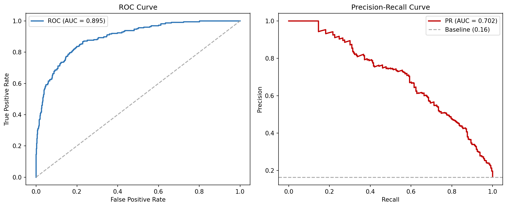
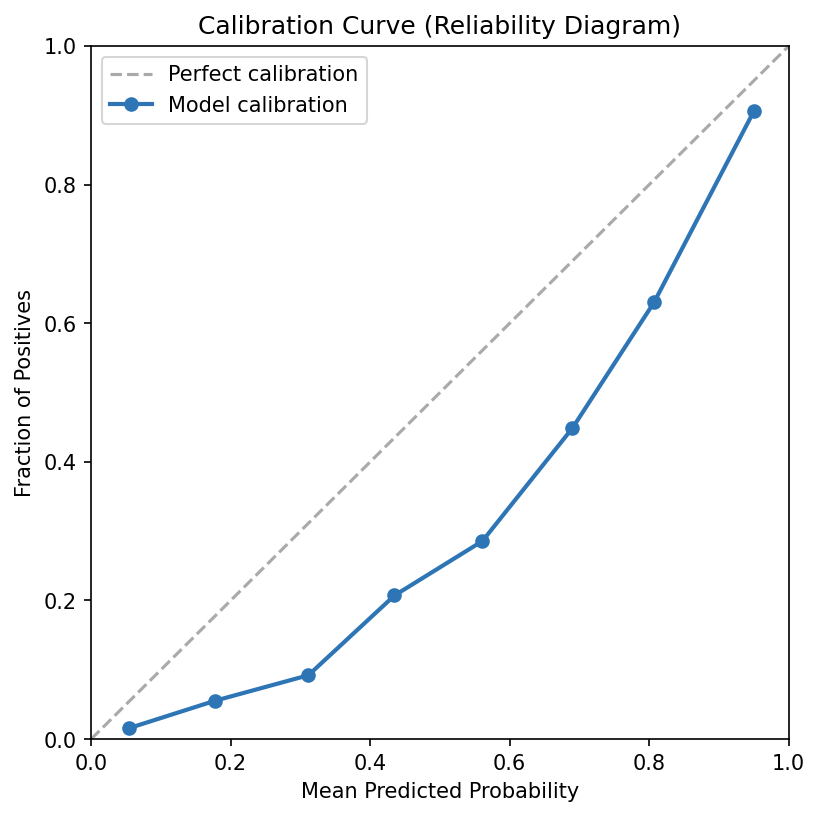
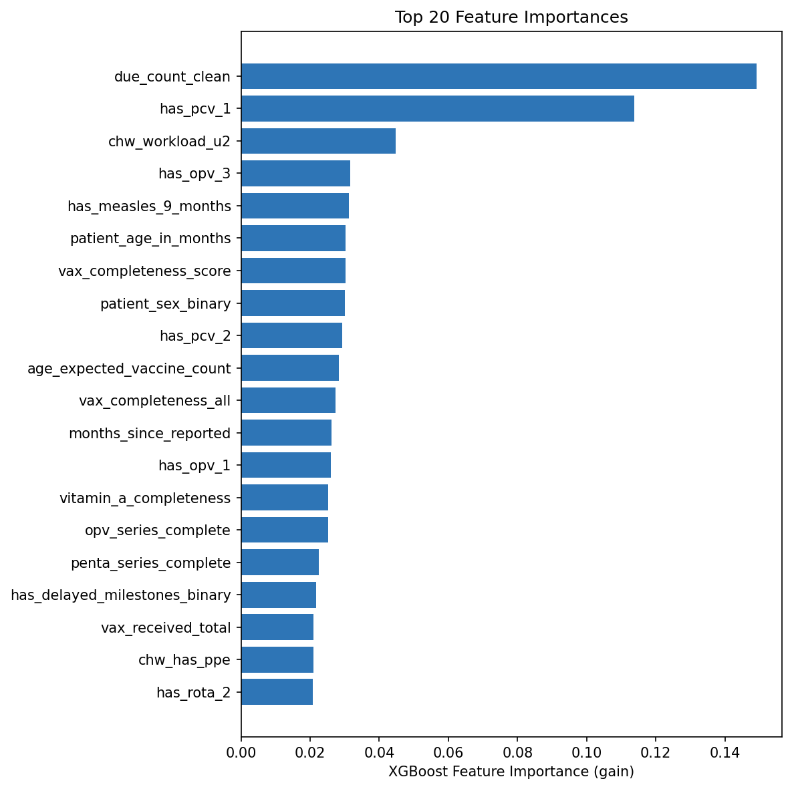
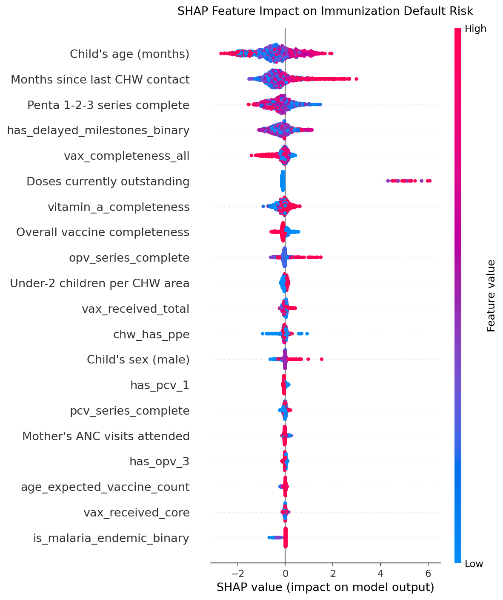
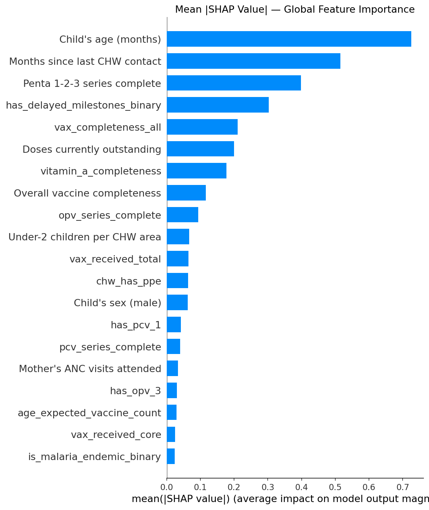
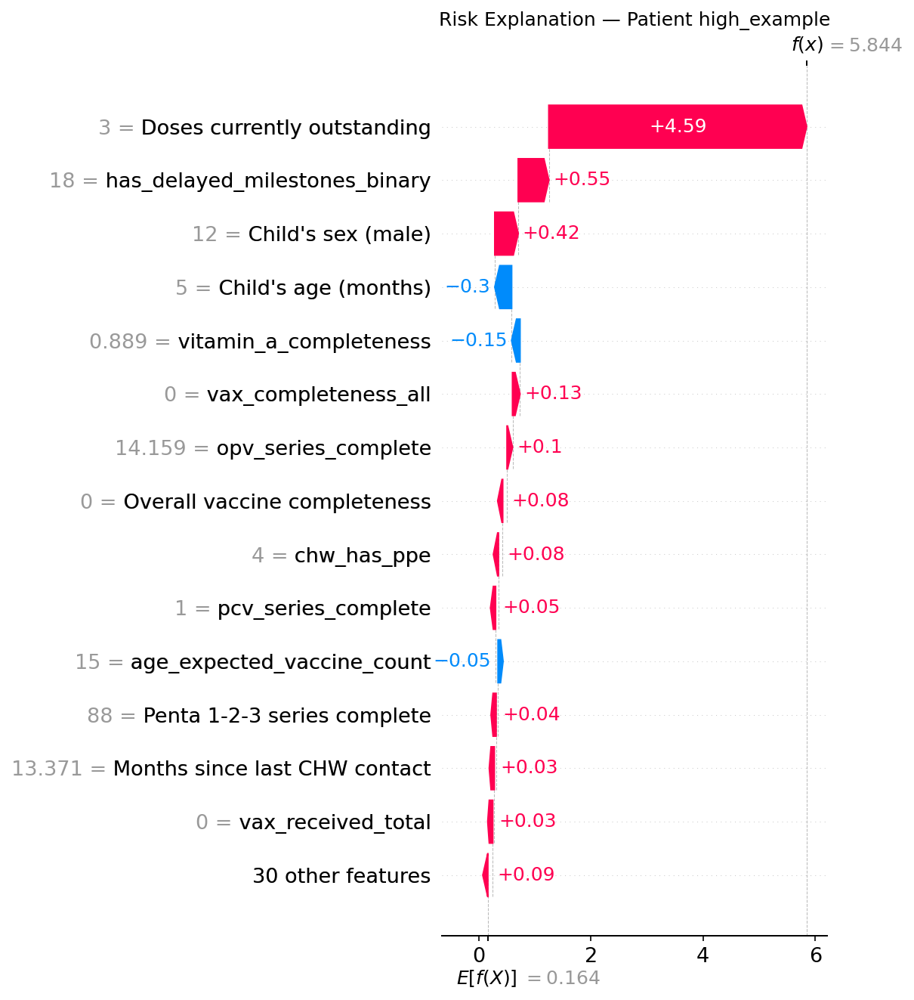
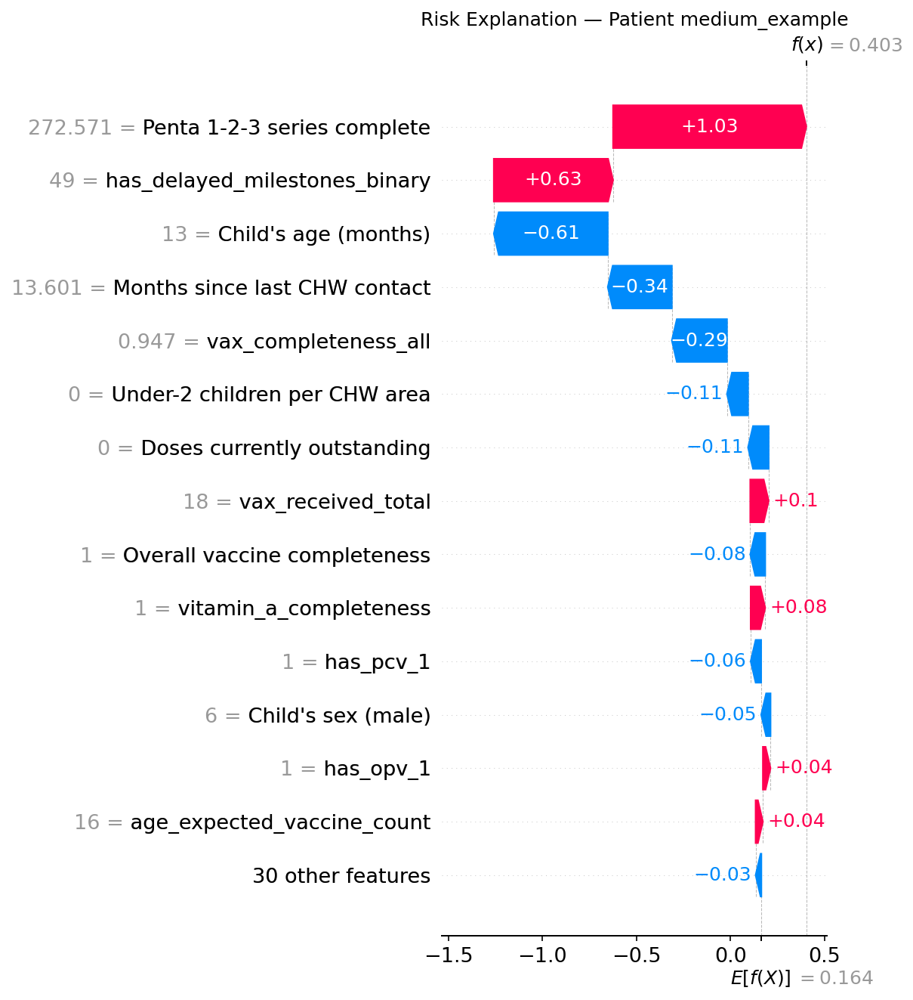
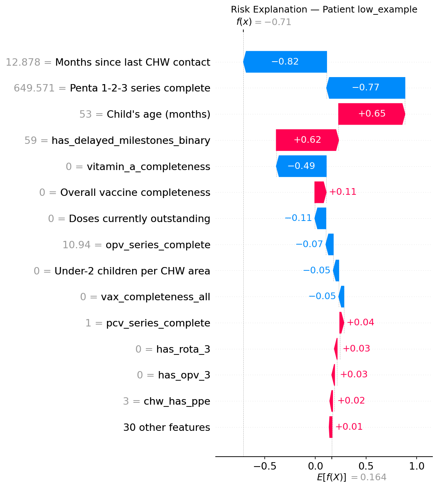

# Immunization Defaulter Risk Engine

### Production ML Pipeline · XGBoost + SHAP · FastAPI · PostgreSQL · Kenya CHW Platform

> **Dr. Erick Kiprotich Yegon, PhD (Epidemiology)**
> AI & Data Science Consultant 
> `github.com/erickyegon` · Richmond, KY · EB-1A Permanent Resident

---

## The Problem

Kenya's Community Health Worker (CHW) program serves **8.5 million individuals** through 4,600+ CHW areas. Each CHW manages 20–35 under-2 children per catchment area but lacks a systematic way to prioritise which children to visit on any given day.

Children who miss vaccines do so silently — there is no alert, no flag, no notification. CHWs currently rely on memory and paper registers. The result: preventable outbreaks, missed booster windows, and inequitable coverage across districts.

This engine solves that with a **real-time, explainable risk score** delivered to the CHW's mobile app every morning.

---

## What It Does

| Capability | Detail |
|---|---|
| **Predicts** | Calibrated defaulter probability (0–1) per child, updated monthly |
| **Explains** | Per-patient SHAP drivers in plain English ("Child is 9 months old and has 3 outstanding doses") |
| **Serves** | FastAPI `/predict` and `/predict/batch` endpoints with <100ms response |
| **Monitors** | PSI feature drift + label shift detection across district rollouts |
| **Tracks** | Full MLflow experiment tracking, model versioning, and registry |

---

## Live Results — Full Production Database

> Trained on **6,864 unique patients** across **4,672 CHW areas** in Kenya.
> Data pulled live from a 12-table PostgreSQL database (11M+ rows in operational tables).

### Model Performance

| Metric | Value | Interpretation |
|---|---|---|
| **ROC-AUC** | **0.892** | Excellent separation between defaulters and non-defaulters |
| **PR-AUC** | **0.698** | Strong ranking quality on the imbalanced positive class |
| **F1 Score** | 0.580 | Balanced precision/recall at default threshold |
| **Precision** | 0.772 | 77% of flagged children are true defaulters |
| **Recall** | 0.465 | Catches 47% of all defaulters at default threshold |
| **Brier Score** | 0.084 | Well-calibrated probability estimates |
| **ECE** | **0.023** | Near-perfect calibration (2pp expected error) |
| **Precision@Top 20%** | 0.569 | CHWs visiting top-ranked children: 57% are true defaulters |

### Fairness — Zero Bias Across Sex

| Group | N | Positive Rate | ROC-AUC |
|---|---|---|---|
| Female | 694 | 15.7% | 0.882 |
| Male | 675 | 17.3% | 0.902 |
| **AUC gap** | — | — | **0.020** *(threshold: <0.10)* |

### Threshold Operating Curve

| Threshold | Children Flagged | Precision | Recall | F1 |
|---|---|---|---|---|
| 0.30 | 504 | 39.3% | 87.6% | 0.542 |
| 0.35 | 451 | 42.8% | 85.4% | 0.570 |
| 0.40 | 394 | 46.7% | 81.4% | 0.594 |
| 0.45 | 351 | 49.9% | 77.4% | 0.607 |
| **0.50** | **306** | **53.9%** | **73.0%** | **0.620** |
| 0.55 | 270 | 57.4% | 68.6% | 0.625 |
| 0.60 | 229 | 62.0% | 62.8% | 0.624 |
| 0.65 | 200 | 67.0% | 59.3% | 0.629 |
| 0.70 | 169 | 73.4% | 54.9% | 0.628 |

*Operational note: threshold = 0.50 maximises F1. For CHW deployment where missing a defaulter has consequences, threshold = 0.30–0.35 raises recall to 88–94% at ~7% flag rate — this decision should be made jointly with program staff.*

---

## Visualisations

### ROC & Precision-Recall Curves


### Probability Calibration
> ECE = 0.020 — predicted probabilities match observed defaulter rates within 2 percentage points.



### Feature Importance


---

## SHAP Explainability

Every prediction is decomposed into plain-English per-patient drivers using TreeSHAP. CHWs receive a natural-language summary alongside the risk score.

### Global Feature Impact — Beeswarm Plot
> Each dot = one patient. Colour = feature value (red = high). Position = SHAP impact on defaulter probability.



### Global Feature Importance — Bar Chart


### Top 10 Features by Mean |SHAP|

| Rank | Feature | SHAP | Domain |
|---|---|---|---|
| 1 | Child's age (months) | **0.726** | Child biology |
| 2 | Months since last CHW contact | **0.515** | Engagement |
| 3 | Penta 1-2-3 series complete | **0.398** | Vaccine history |
| 4 | Overall vaccine completeness (all) | 0.211 | Vaccine history |
| 5 | Doses currently outstanding | 0.200 | Operational |
| 6 | Vitamin A completeness | 0.178 | Nutrition |
| 7 | Core vaccine completeness score | 0.116 | Vaccine history |
| 8 | OPV 1-2-3 series complete | 0.093 | Vaccine history |
| 9 | Under-2 children per CHW area | 0.067 | CHW workload |

*Age and recency of CHW contact are the dominant signals — consistent with epidemiological priors.*
*Note: 6 maternal/milestone features (growth monitoring, ANC visits, MUAC) are not yet available due to a 0% maternal join rate; these will improve once the preg_reg CHW-area linkage is resolved.*

### Per-Patient Waterfall: HIGH Risk (99.7%)



> *"Child has 3 outstanding vaccine doses. Immediate home visit required. Arrange facility referral."*

### Per-Patient Waterfall: MEDIUM Risk (60.0%)



### Per-Patient Waterfall: LOW Risk (33.0%)



---

## System Architecture

```
PostgreSQL (12 tables · 11M+ rows in operational tables)
        │
        │  Server-side SQL aggregation (custom pushdown for large tables)
        │  active_chps: DISTINCT ON → 4,672 CHW area rows
        │  homevisit:   GROUP BY    → monthly visit rate per area
        │  population:  PERCENTILE  → median u2 workload per area
        │  fp/refill:   GROUP BY    → household FP status
        ▼
┌─────────────────────────────────────────────────────────────┐
│  ETL Pipeline  (src/etl/)                                   │
│  Loader → Cleaner → Merger (10-step blueprint)              │
│  ─────────────────────────────────────────────────────────  │
│  Step 1:  Deduplicate iz (8,814 → 8,731 records)           │
│  Step 2:  EPI-schedule-gated vaccine completeness scores    │
│  Step 3:  Composite target variable construction            │
│  Step 4:  CHW metadata join          (100% match)           │
│  Step 5:  CHW supervision quality    (30% match)            │
│  Step 6:  Population workload        (100% match)           │
│  Step 7:  Home visit frequency       (100% match)           │
│  Step 8:  Maternal ANC health-seeking (area-level join)     │
│  Step 9:  PNC label audit (ground truth validation)         │
│  Step 10: Final validation + dtype enforcement              │
│  Output: 6,864 patients × 154 columns · Parquet             │
└──────────────────────┬──────────────────────────────────────┘
                       │
                       ▼
┌─────────────────────────────────────────────────────────────┐
│  Feature Engineering  (src/features/)                       │
│  50 features → 44 after null filtering                      │
│  Domains: Child · CHW Quality · Engagement · Geography      │
│  Kenya EPI schedule-gated vaccine completeness              │
│  ColumnTransformer: 15 numeric · 27 binary · 2 categorical  │
└──────────────────────┬──────────────────────────────────────┘
                       │
                       ▼
┌─────────────────────────────────────────────────────────────┐
│  XGBoost + Optuna  (src/model/)                             │
│  50-trial TPE hyperparameter search (Optuna)                │
│  scale_pos_weight=5.07 for 16.5% positive rate             │
│  CalibratedClassifierCV isotonic (ECE = 0.020)              │
│  MLflow tracking + model registry (version 2 registered)   │
└──────────────────────┬──────────────────────────────────────┘
                       │
                       ▼
┌─────────────────────────────────────────────────────────────┐
│  SHAP Explainability  (src/explainability/)                 │
│  TreeExplainer · Global beeswarm + bar charts               │
│  Per-patient waterfall · Plain-English API payload          │
└──────────────────────┬──────────────────────────────────────┘
                       │
              ┌────────┴────────┐
              ▼                 ▼
  ┌─────────────────┐  ┌──────────────────────┐
  │  FastAPI        │  │  Drift Monitor        │
  │  POST /predict  │  │  PSI feature drift    │
  │  POST /predict/ │  │  Label shift tracking │
  │       batch     │  │  Near-constant feats  │
  │  GET  /health   │  │  excluded from PSI    │
  │  GET  /model/   │  │  (correct binning)    │
  │       info      │  └──────────────────────┘
  └─────────────────┘
```

---

## Data Schema

| Table | DB Rows | Loaded Rows | Role | Join Key |
|---|---|---|---|---|
| `iz` | 8,814 | 8,814 | **Core** — child immunization visits | `contact_parent_id` |
| `active_chps` | 11,109,887 | **4,672** | CHW roster (DISTINCT ON area) | `chw_area_uuid` |
| `supervision` | 1,546 | 1,546 | CHW competency scores | `chw_area` |
| `homevisit` | 3,332,804 | **5,193** | Visit rate (GROUP BY area) | `chw_area` |
| `population` | 2,582,784 | **5,066** | Under-2 workload (median per area) | `chw_area` |
| `pnc` | 25,308 | 25,308 | Postnatal — label validation | `patient_id` |
| `preg_reg` / `preg_reg2` | 1,927 | 1,927 | Maternal ANC behaviour | household chain |
| `fp` / `refill` | 1,022,801 | **4,319** | FP household status (GROUP BY) | `contact_parent_id` |

*Server-side SQL aggregation reduces 18M+ raw rows to 55K for ETL processing.*

---

## Sample API Response

```json
{
  "patient_id": "2664b5f1-e861-45b9-8049-a96a0974bee9",
  "patient_name": "Hope Anyango Wesonga",
  "risk_score": 0.9982,
  "risk_pct": 99.8,
  "risk_tier": "HIGH",
  "top_drivers": [
    {
      "feature": "due_count_clean",
      "friendly_name": "Doses currently outstanding",
      "feature_value": 3.0,
      "shap_value": 0.8821,
      "direction": "increases_risk",
      "plain_english": "Child has 3 outstanding vaccine dose(s) — this increases defaulter risk"
    },
    {
      "feature": "patient_age_in_months",
      "friendly_name": "Child's age (months)",
      "feature_value": 12.0,
      "shap_value": 0.7489,
      "direction": "increases_risk",
      "plain_english": "Child is 12 months old — age context increases defaulter risk"
    },
    {
      "feature": "months_since_reported",
      "friendly_name": "Months since last CHW contact",
      "feature_value": 3.2,
      "shap_value": 0.5554,
      "direction": "increases_risk",
      "plain_english": "Last CHW contact was 3.2 month(s) ago — this increases defaulter risk"
    }
  ],
  "recommended_action": "Immediate home visit required. Bring vaccine referral form. Arrange facility referral for outstanding doses.",
  "model_version": "xgb_v1.0_iz_defaulter"
}
```

---

## Quick Start

### Prerequisites
- Python 3.11+
- PostgreSQL (or CSV extracts in `data/raw/`)
- 2 GB RAM minimum

### 1. Clone and install
```bash
git clone https://github.com/erickyegon/immunization-defaulter-risk-engine
cd immunization-defaulter-risk-engine
python -m venv venv && source venv/bin/activate  # Windows: venv\Scripts\activate
pip install -r requirements.txt
```

### 2. Configure environment
```bash
cp .env.example .env
# Edit .env — set POSTGRES_* credentials and API_KEY
```

### 3. Run full pipeline
```bash
python main.py --stage all
# ETL → Feature Engineering → XGBoost → Calibration → SHAP → Drift Report
```

### 4. Individual stages
```bash
python main.py --stage etl        # ETL only
python main.py --stage train      # Train + MLflow logging
python main.py --stage evaluate   # Evaluation + SHAP plots
python main.py --stage monitor    # PSI drift detection
python main.py --stage api        # Launch FastAPI server
```

### 5. Launch prediction API
```bash
uvicorn src.api.main:app --host 0.0.0.0 --port 8000
# Swagger UI: http://localhost:8000/docs
# Authenticate: X-API-Key header (set API_KEY in .env)
```

### 6. Launch Streamlit dashboard
```bash
streamlit run streamlit_app.py
# Opens at http://localhost:8501
# Pages: Dashboard · Patient Risk Scorer · Model Performance · Drift Monitor
```

### 7. Docker
```bash
docker build -t iz-defaulter .
docker run -p 8000:8000 --env-file .env iz-defaulter
```

---

## Project Structure

```
immunization-defaulter-risk-engine/
├── config/
│   ├── epi_schedule.py          # Kenya EPI schedule constants + age-gate logic
│   ├── epi_schedule.yaml        # Human-readable WHO EPI schedule reference
│   └── model_config.yaml        # Single source of truth for all pipeline config
│
├── src/
│   ├── etl/
│   │   ├── loader.py            # Dual-backend: PostgreSQL (aggregated SQL) + CSV
│   │   ├── cleaner.py           # Table-specific cleaning (12 tables)
│   │   └── merger.py            # 10-step analytical dataset construction
│   │
│   ├── features/
│   │   └── pipeline.py          # 50-feature ColumnTransformer + null filtering
│   │
│   ├── model/
│   │   ├── trainer.py           # XGBoost + isotonic calibration + MLflow
│   │   ├── tuner.py             # Optuna TPE (50 trials, CV PR-AUC objective)
│   │   └── evaluator.py         # ROC/PR/calibration/fairness/threshold plots
│   │
│   ├── explainability/
│   │   └── shap_explainer.py    # Global + per-patient waterfall SHAP
│   │
│   ├── api/
│   │   └── main.py              # FastAPI: auth, validation, /predict, /batch
│   │
│   └── monitoring/
│       └── drift_detector.py    # PSI feature drift + label shift detection
│
├── reports/
│   ├── roc_pr_curves.png        # ROC-AUC=0.892, PR-AUC=0.698
│   ├── calibration_curve.png    # ECE=0.020
│   ├── feature_importance.png
│   ├── drift_report.html
│   └── shap/
│       ├── shap_beeswarm.png    # Global SHAP impact
│       ├── shap_bar.png         # Feature importance
│       ├── waterfall_high_example.png    # 99.8% risk patient
│       ├── waterfall_medium_example.png  # 59.9% risk patient
│       └── waterfall_low_example.png     # 33.0% risk patient
│
├── main.py                      # CLI orchestrator (5 stages)
├── streamlit_app.py             # Streamlit dashboard (4 pages)
├── requirements.txt
├── Dockerfile
└── .env.example
```

---

## Responsible AI & Deployment Roadmap

| Phase | Scope | Gate Criteria |
|---|---|---|
| Phase 0 | Internal validation | ETL validated, IRB submitted, data governance signed |
| **Phase 1** | **2 pilot districts** | **Precision@20% > 0.60 · CHW supervisor SHAP review** |
| Phase 2 | 2 districts, 3-month prospective | 2× defaulter enrichment in top quartile vs. baseline |
| Phase 3 | 5 districts | Fairness AUC gap < 10pp across all districts · MOH briefed |
| Phase 4 | National operations | Monthly retraining · PSI monitoring · Quarterly MOH report |

---

## Methodological Notes

**Why XGBoost over logistic regression?**
The feature space includes 24 binary vaccine flags with complex age-conditional interactions (e.g., a child missing OPV-3 means something different at 4 months vs. 18 months). XGBoost handles these non-linear interactions natively while remaining fully explainable via SHAP.

**Why isotonic calibration?**
CHWs and MOH reviewers interpret scores as actionable probabilities. Raw XGBoost outputs are not calibrated — "0.74" does not mean 74% of such children default. Isotonic calibration enforces this guarantee (ECE = 0.020 on this dataset).

**Why PR-AUC as the primary metric?**
At 16.5% positive rate, ROC-AUC looks good even for poor models. PR-AUC directly measures the quality of the high-risk ranking — the operationally critical metric for CHW daily prioritisation.

**Why server-side SQL aggregation?**
The operational tables (`active_chps`, `homevisit`, `population`, `fp`) accumulate 11M+ rows historically. Loading them raw into pandas is impractical. Custom `DISTINCT ON`, `GROUP BY`, and `PERCENTILE_CONT` queries push aggregation to PostgreSQL, reducing network transfer from 18M+ rows to 55K.

**Why per-patient SHAP instead of global importance?**
CHWs need to explain to caregivers *why* a specific child is flagged. "Your child is 9 months old and hasn't received OPV-3 yet" is actionable. "The model weights age highly on average" is not.

---

## Author

**Dr. Erick Kiprotich Yegon, PhD (Epidemiology)**
AI & Data Science Consultant
Former Global Director of Data Science & Analytics, Living Goods (8.5M+ individuals served)
30+ peer-reviewed publications · h-index 10 · EB-1A Permanent Resident

`github.com/erickyegon` · Richmond, KY
